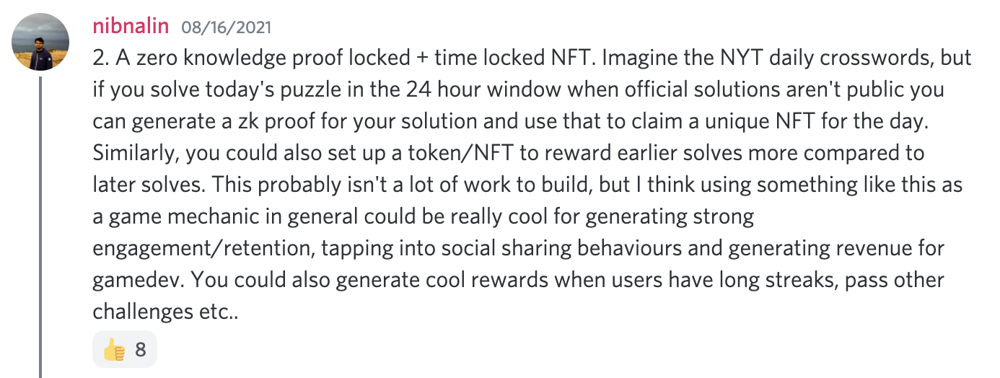
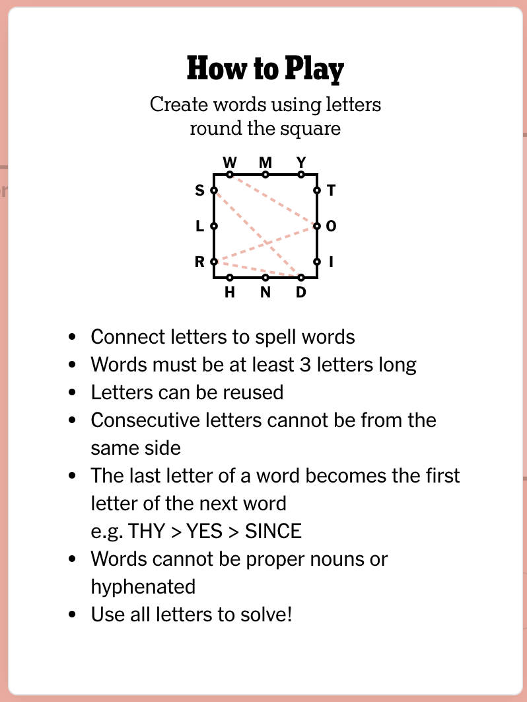
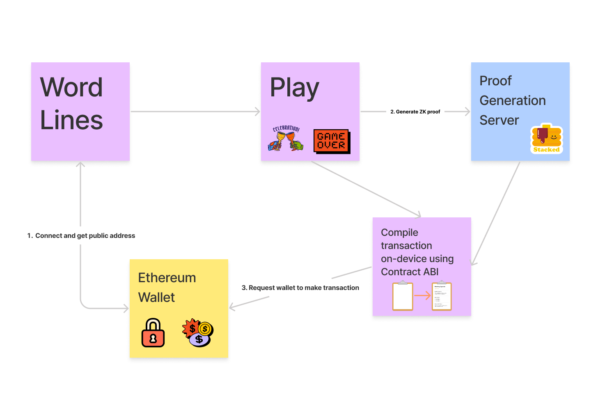
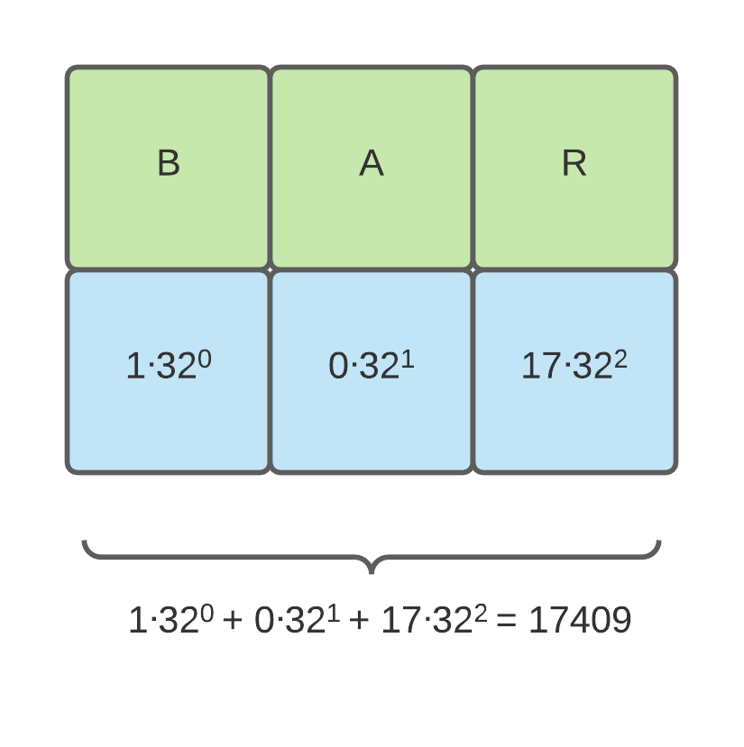
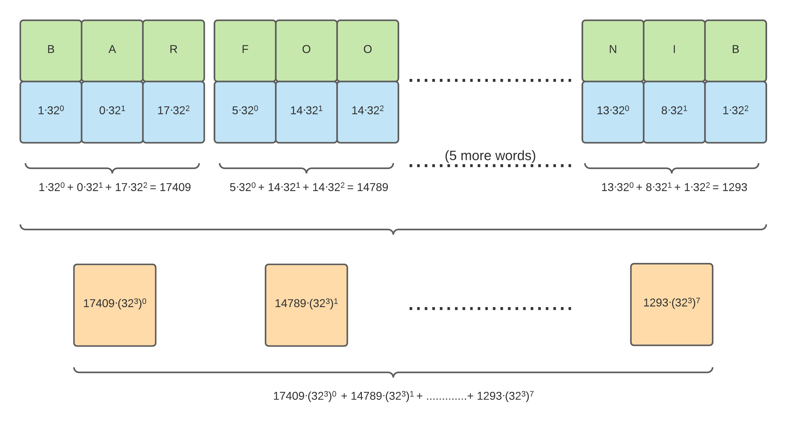
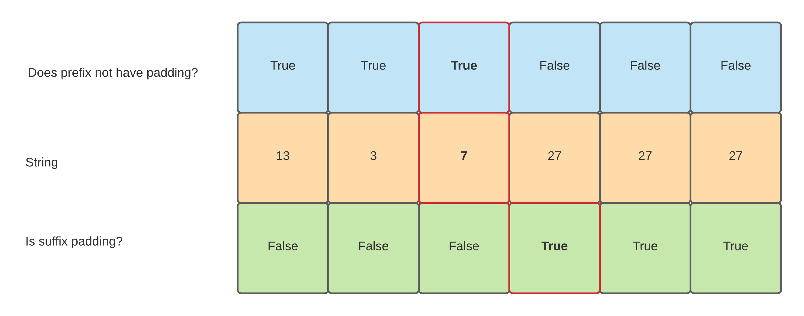

# WordLines

## Mobile ZK Puzzle Game with NFT rewards

WordLines is a ripoff of [NYT's Letter Boxed game](https://www.nytimes.com/puzzles/letter-boxed) on the Ethereum chain. It has a mobile client that connects to mobile wallets and uses NFTs as a reward/retention mechanism.

This project was made during [ETH Summer](https://summer.ethuniversity.org). Special thanks to [@gubsheep](https://github.com/gubsheep/) for supporting me in this project.

# Client Demo

https://user-images.githubusercontent.com/6984346/131266538-1a5a49ea-806c-4f71-8b39-f4295812b240.mp4

### User flow:

- User starts by connecting their wallet to the app via the [WalletConnect protocol](https://walletconnect.org)
- User plays the game, processes ZK proof, and assembles calldata for a transaction calling the NFT minting smart contract
- Transaction is submitted back to the wallet, which handles signing, broadcasting, gas pricing etc.

You can play with the demo yourself using TestFlight! [Hit me up](https://nibnalin.me/about/) and I can add you as a tester.

# Product Notes

There were 4 primary ideas when I originally started thinking about this project:

- **Zero knowledge**: Originally, I was motivated by the namesake property of zero knowledge proofs to support "global" puzzles in a decentralised, provable environment (much like how DarkForest uses zk proofs), puzzles like [sudoku](https://github.com/nalinbhardwaj/snarky-sudoku), [poker](https://medium.com/coinmonks/zk-poker-a-simple-zk-snark-circuit-8ec8d0c5ee52) and crosswords seemed like obvious candidates for good ZK powered blockchain-native games: You have a relatively simple puzzle, and motivation for using ZK is very obvious since there are no clean non ZK mechanisms to prove your solution outside of sharing the solution itself. Some games might be supportable with commit-reveal schemes, but the inherent delay in the reveal is quite _unfun_.

- **NFTs**: Game rewards in the form of NFT would serve as a cool retention loop that make the secondary market of the game a fun addon by itself. A lot of games use in-game items and rewards as a game mechanic to bring back users, and I see NFTs as the blockchain-native way to encode such items.

- **Mobile**: Mobile gaming is more interesting than PC/web clients to me. If nothing it means developers can use push notifications and make games a much more mindless/regular part of players' day vs. depending on users to actively seek out their game on their computers. As far as I am aware, there aren't any other open source blockchain based zk games, so I also found the challenge of building this on iOS to be technically exciting.

- Time-locked: Originally, I planned to build a mechanism similar to New York Times crosswords. Every day, there would be a new puzzle and you can only solve the puzzle and claim its NFT in the 24 hours following release. This would create a somewhat artificial scarcity for tokens and encourage trades in secondary markets. I didn't get to building this, but I have some thoughts on how the current implementation can be extended to support it. [Hit me up](https://nibnalin.me/about/) if you're building a mechanism like this in your blockchain game!

I ultimately decided to build out my version of NYT's popular daily game [Letter Boxed](https://www.nytimes.com/puzzles/letter-boxed). This is a relatively simple game with rules as follows:

Since the game has a pretty visual representation, it comes with the added advantage that we can simply use a game solution as the NFT image! Unfortunately, however, it also comes with the disadvantage that the game has multiple solutions, and the only clean way to validate them is to encode an entire dictionary of words in the zk circuit (more on that later).

# Technical Notes

The general architecture of the service involves a lot of back and forth between Ethereum chain (via wallet), a central server for computing ZK proofs (sadly, this app isn't truly decentralised due to this limitation 😢), the smart contract that mints the WordLinesToken and finally a Swift client that compiles user inputs into CALLDATA using the contract's ABI.

More detailed notes on each aspect of the app below:

## ZK circuit

The circuit assumes an input of the following parameters:

- private input "line": your solution to the puzzle
- public input "figure": an encoding of the figure for the puzzle
- public input "dictionary": a dictionary of words considered "valid" for the puzzle figure
- private input "private_address": the address of the user solving this puzzle
- public input "address": copy of private_address.

The first three inputs are used to fully describe the solution to the proof. For instance, for the puzzle in the demo video, the "line" would be: `["from", "music", "click", "king"]`, the "figure" would be `[["l", "u", "k"], ["r", "m", "i"], ["s", "c", "n"], ["o", "g", "f"]]` and the dictionary would be all the words that are possible to make using the letters in the figure. The core circuit enforces three rules on these inputs:

1. All letters of the figure are covered at least once by the word letters
2. Every word belongs to the dictionary.
3. Every word in the line starts with the letter the previous word ended with.

Note that we are not enforcing the "consecutive letters must be from different sides" rule explicitly. That is enforced by the precomputed "dictionary" input: only words with consecutive letters on different sides are put into the dictionary by the contract owner (the "game master").

More on enforcement of each of the rules follows, but first, let's talk about polynomial hashing and word representations.

### Polynomial Hashing

To represent a word as an integer, we use the general idea of rolling hashes, and encode the word as shown below:

Each letter is represented by one digit in the base 32 representation and since we limit the length of input words to 6 characters, we obtain a unique representation of all possible words in integers less than 326 = 25\*6 = 230. Note that we can technically go with a smaller base (like 29), but it is useful to choose a power of 2 since that allows us to work with the individual character binary representations in a clean way using the circomlib [`Bits2Num`](https://github.com/iden3/circomlib/blob/master/circuits/bitify.circom#L54) and [`Num2Bits`](https://github.com/iden3/circomlib/blob/master/circuits/bitify.circom#L24) circuits. This hashing and character extraction is implemented in the [`CharExtractor`](https://github.com/nalinbhardwaj/wordlines/blob/main/zkaffold-eth/packages/circom/circuits/wordlines/words.circom#L124) template.

### Compression

I noticed (in the notebook described in the [Puzzle Generation](https://github.com/nalinbhardwaj/wordlines#puzzle-generation) section) that we need \~800-1000 words to make a interesting puzzle with multiple reasonable solutions.

With the aforementioned rolling hash trick, we can store each word as one public input to the circuit, but this is not enough. I tried deploying this version and discovered that the contract runs into the 24kb smart contract size limit. This is because each public input to the circuit corresponds to an `IC` in the [proof verifying function]() and with 256bit `IC`s you quickly pass the 24kb number at \~100 or so public inputs.

The solution to this is described by the description of the problem itself. Solidity supports 256bit integers, and circom, too, works in a prime field of size more than 2255. Even with the previously mentioned rolling hash trick, we are only using 30 bits in each of the input. So, we can compress the dictionary and store 255/30 = 8 words per input. With this trick implemented, we can actually support \~800 word dictionaries!

The decompression of words stored with this trick is implemented in the [`ExtractDictionary`](https://github.com/nalinbhardwaj/wordlines/blob/main/zkaffold-eth/packages/circom/circuits/wordlines/words.circom#L5). There's a lot of bookkeeping involved in order to keep track of the multiple layers (compressed dictionary, uncompressed dictionary, individual words and the individual letters of a word), but the core logic is the same.

### Padding

Since circom doesn't natively support variable length inputs, you have to support the maximum input limits possible for your circuit and build out some form of padding support. In this ZK circuit, there are two kinds of padding:

- Letter paddings: Words are limited to having a maximum of 6 characters, so any shorter words are padded with the integer 27.
- Word paddings: The dictionary is limited to 90 inputs (720 words), so any excess words are padded as words with integer 28 repeated many times. The "line" input is limited to 6 words, so they are padded in a similar way.

The primary motivation to distinguish the two types of paddings was to prevent any weird hacks that may try to get around the rules by using word paddings as a line input or vice versa.

### [CheckFigure](https://github.com/nalinbhardwaj/wordlines/blob/main/zkaffold-eth/packages/circom/circuits/wordlines/words.circom#L142)

This function (or *template* in circom parlance) checks if every letter in the figure is covered by the user's solution or not. It works in two stages. First, we check if each letter in the figure shows up in at least one word in the solution. For this, we use a prefix sum like structure and have components identified by (figure_index, line_index, word_index) answering the question "Is the `figure_index`th letter in the prefix of solution before `line_index` or in the first `word_index` characters of the `line_index`th word?" This component's values can be computed cleanly going from left to right, and finally we can check that the output from the component at the (figure_index, line_size, max_word_size - 1) is true for all `figure_index` using a `MultiAND` gate. This generates O(figure_size * line_size * max_word_size) intermediary signals/components.

### [InDictionary](https://github.com/nalinbhardwaj/wordlines/blob/main/zkaffold-eth/packages/circom/circuits/wordlines/words.circom#L26)

This is a relatively simple function that checks if a passed word is in the dictionary or not. Once we have extracted the dictionary words from their compressed format into their original values, we can do a simple prefix-sum like loop over the dictionary and check for equality against all words. This is the bottleneck function in our circuit, since it requires O(line_size * dictionary_size) components. More on optimising this further at the end.

### [IsContinual](https://github.com/nalinbhardwaj/wordlines/blob/main/zkaffold-eth/packages/circom/circuits/wordlines/lines.circom#L5)

This function checks the final condition, "does every word start with the letter the previous word ended with?". On the surface, this seems like a simple function. We loop over all the words in the line and check if the last character of the previous word is equal to the first character of this one, and again use a simple prefix-sum like structure to check the validity of all the words. However, due to the previously mentioned padding mechanism, extract the last character is surprisingly non-trivial. There are some clever ways to get around this, but the solution that made most sense to me at the time was my implementation of `ExtractLastChar`, described next.

### [ExtractLastChar](https://github.com/nalinbhardwaj/wordlines/blob/main/zkaffold-eth/packages/circom/circuits/wordlines/words.circom#L61)

This is one of the most interesting functions in the circuit. While it only extracts the last character of a word, doing so requires a few clever tricks and the use of the prefix/suffix sum ideas described earlier.

Let's break down the problem we're trying to solve: find the last character in an array of integers such that it is not 27. To express this in the form of the circuit that has linear conditionals on each variable, we need a way to "turn off" contribution from the suffix of paddings of 27, and turn off the contribution from the prefix of values with some value != 27 to their right. That's almost verbatim what the template does: define two arrays of components `does_prefix_not_have_padding[WORD_SIZE]` and `is_suffix_padding[WORD_SIZE]`. As the name suggests, the only letter such that `does_prefix_not_have_padding[i]` is true and `is_suffix_padding[i+1]` is also true is the the last character of the non-padded string. So we can compute an AND() for every bit (5 bits since each letter is represented in base 32) of the letter with the two aforementioned signals, obtaining our answer!

*Notice that does_prefix_not_have_padding[i] AND is_suffix_padding[i+1] AND letter[i] is only non-zero for the last character.*

These circuits went through a few iterations, starting with a simple word comparison based circuit, followed by a second step to employ polynomial hashing to reduce inputs by a factor of word length(*6 times*), finally followed by the use of the clever compression trick to store *8 times* as many words per input. The [git](https://github.com/nalinbhardwaj/wordlines/commit/2019af49dbb7310a54cbd27e218fc1ec7fff25b3) [history](https://github.com/nalinbhardwaj/wordlines/commit/e59ed70ea59d0a14a71f6195fc9b18f61d285367) of this project is a cool way to walk through me fumbling my way across each of these ideas.

Notice that I haven't talked about the last two inputs to the circuit in this section (`private_address` and `address`). They are used to prevent replay attacks. More to follow on that in [ERC721 Smart contract: Replay attacks](https://github.com/nalinbhardwaj/wordlines#replay-attacks).

## ERC721 Smart contract

### Implementation

The smart contract implements two functions, `mintItem` and `addToken`.

`mintItem` allows anyone to submit their proof and "redeem" their NFT. It asserts a few conditions before redeeming: the public input "address" matches the adress trying to redeem the NFT (as described in [Replay attacks]), the input line and dictionary correspond to a valid NFT added using `addToken`, and that the address is not claiming the NFT a second time. The last condition is only meant to deter malicious actors from trying to claim an infinite supply of NFTs, and slowing them down by forcing them to generate a new address and a new zk proof corresponding to that new address before being able to mint a new token.

The `addToken` function allows the owner of the contract to essentially add more puzzles by passing in a token URI corresponding to some public inputs(dictionary and figure).

### Replay attacks

Since the puzzle's proof (the "line") is independent of a user and everyone's proof is public on the Ethereum chain, anyone can theoretically copy an old proof and rebroadcast it as their own. To prevent this, I've added a simple mechanism via the "private_address" and "address" inputs. The smart contract asserts that the NFT minter address matches the "address" input to the circuit, and the circuit itself has a simple assertion that the private input "private_address" does indeed match the public input. This means that each proof is now locked to a single address, and the only way for an attacker to derive a valid proof from someone else's proof is to edit both private and public inputs, rendering it useless.

### Deployment, minting etc.

I've used [`scaffold-eth`](https://github.com/austintgriffith/scaffold-eth/tree/zkaffold-eth) to handle development of the smart contracts, but unfortunately I found that it's documented quite inadequately. I ended up significantly rewriting their deploy/mint scripts and moving to a simple js script instead of using HardHat for handling deployments.

The [`deploy.js`](https://github.com/nalinbhardwaj/wordlines/blob/main/zkaffold-eth/packages/hardhat/scripts/deploy.js) script is relatively untouched, except for adding support for redeploying a previously generated contract, and cleaning up some code around the deployment process to non-localhost chains.

The [`mint.js`](https://github.com/nalinbhardwaj/wordlines/blob/main/zkaffold-eth/packages/hardhat/scripts/mint.js) script is a bit of misnomer now since all it does is add the ability to redeem new inputs (by giving them a corresponding token URI). It was significantly rewritten to support uploading JSON puzzle NFTs to IPFS and transferring ownership of the contract to a stable address and the ability to use that address instead of the default contract owner address to add new redeemable NFTs post initial deployment/ownership transfer.

## Puzzle Generation

Puzzles are generated using the [iPython notebook](https://github.com/nalinbhardwaj/wordlines/blob/main/wordline-generator.ipynb). The puzzles are generated by seeding a random line and tyring to find ways to extend in a way the corresponding figure has a "large" dictionary and has many common English words. I use the standard scrabble dictionary for the full dictionary generation, and Peter Norvig's [ngrams corpus](https://norvig.com/ngrams/) for guaranteeing that there are solutions only consisting of "popular" words.

Later, I also found [this blog by Ned Batchelder](https://nedbatchelder.com/blog/202004/letter_boxed.html) and [this website from Alice Liang](http://letterboxed.aliceyliang.com) that discuss how to solve the original NYT Letter Boxed puzzle efficiently. They are good reads with many similar ideas that I came up with independently for puzzle generation (backtracking, word popularity, etc.).

## Proof generation server

Since running zk circuits is non trivial on iOS (since we need to inject wasm files and zkeys which seems almost impossible in Swift), I decided to use a simple centralised server to run the proof generation. This is a pretty simple `expressjs` server contained entirely in a [single file](https://github.com/nalinbhardwaj/wordlines/blob/main/zk-node-server/index.js). I originally tried using a serverless platform (vercel) for the proof generation server but I underestimated the memory/time contraints of snarkjs. It isn't possible to run zk proof generations on the free tiers of most serverless platforms I checked (vercel, cloudflare workers, AWS lambda) since you'll either run into time constraints or memory constraints. Even now, the monolothic expressjs server is hosted on Heroku's free dyno, and often exceeds the memory quotas if there are multiple concurrent requests.

## Mobile client

The mobile client is implemented in Swift and most of the crypto relevant code lives in [ActionsViewController.swift](https://github.com/nalinbhardwaj/wordlines/blob/main/zk-ios-client/WordLinesApp/ActionsViewController.swift) and [MainViewController.swift](https://github.com/nalinbhardwaj/wordlines/blob/main/zk-ios-client/WordLinesApp/MainViewController.swift). These are largely based on code from [`WalletConnect/WalletConnectSwift`](https://github.com/WalletConnect/WalletConnectSwift) and  [`gnosis/safe-ios`](https://github.com/gnosis/safe-ios/blob/main/Multisig/UI/WalletConnect/WalletConnectClientController.swift). The game UI primarily lives in [gameSquare.swift](https://github.com/nalinbhardwaj/wordlines/blob/main/zk-ios-client/WordLinesApp/gameSquare.swift) and is implemented in SwiftUI and attached to the Actions View controller via a `UIHostingController`.

To assemble the `CALLDATA` in the client, I use the [`Web3.swift`](https://github.com/Boilertalk/Web3.swift) package. The contract's ABI is hosted on the central server and fetched by the iOS client when needed.

## Other ideas

There are two alternate (better) solutions (perhaps for a future project) for resolving the issues around large dictionary sizes and exceeding the contract size limit:

- *Bloom filters*: Dictionary lookups are the classic use case for dictionary lookups, and it is likely hard/impossible to exploit the false-positive matching nature of bloom filters in any useful way (given the other constraints of the circuit). We can probably use any of the zk-safe hashes like mimc, Poseidon or Pedersen hashes (or all of them). We probably need to be careful about the number of constraints in the circuit with this approach, the number of constraints in the circuit already exceed ~40k, so adding too many more constraints will make this application infeasible.
- *Merkle path proofs*: All words of the dictionary can be put on the leaves of a merkle tree, and we can ask the solver to present the merkle path proof of O(log N) node hashes per word in the solution.
